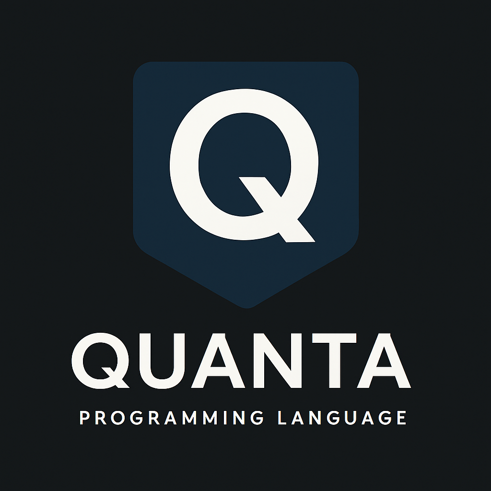

# Quanta 🚀  
*A Programming Language by GeoVaz09*  

**This README and logo was generated with AI assistance.**

---

## 🧩 Overview  

**Quanta** is a custom programming language with a Python-based interpreter, designed for experimentation, pain and confusion. (I would consider it an esolang). 

The project includes two built-in CLI games:

🎮 Rock, Paper, Scissors – A classic game against the computer.

🔢 Bigger or Smaller – A number guessing game where players try to guess the correct number in the fewest attempts. (Max. 10 attempts)

Both games showcase Quanta's ability to handle user input, logic, and control flow — making it one of the worst ;) starting point for learning and exploring programming through custom language design (which is mostly made with bad code).

  

---

## ⚙️ Features  
- **Custom syntax**: BAD and NOT easy to learn. (I would consider it an esolang)
- **Interpreter**: interactive execution with almost no debugging help
- **Built-in standard library**: basic math, data structures.  (I think, I am not quite sure if it is even turing-complete)
---

## Quanta Playground
- A playground site for testing Quanta
- Test Quanta on the official <a href="https://geovaz09.github.io/Quanta/">Playground</a>

Steps:
1. Select the script you want to test
2. Press "View Source" to see the exaple's source code (Optional)
3. Press "Run ▶" to copy exaple file's name and go to the Playground
4. After it loads, on the "File to load:" input --paste the exaple file's name
5. Use the script
 
(Note: this link uses an online‑Python environment to simulate or test Quanta code.)
 
💬 Documentation & Further Help (Or ask Chat GPT and pray it works)

---

## 📣 Acknowledgments

    Developed by GeoVaz09 ( @George Vazakas on Slack )

    *README and logo generated with AI assistance*

Thank you for checking out Quanta—happy coding!
